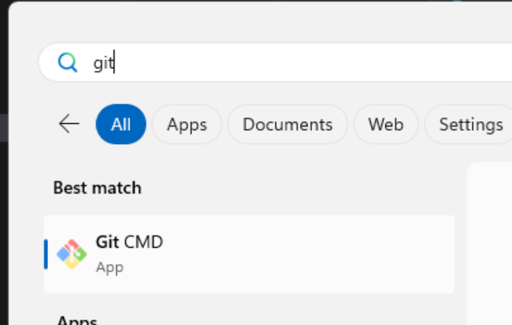
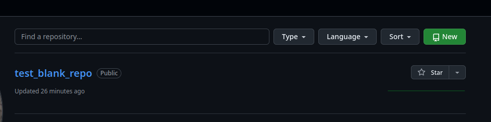
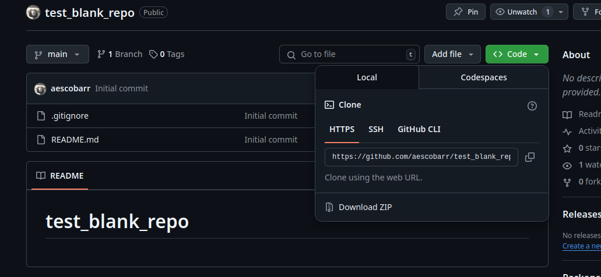

# Conceptes bàsics GitHub

* [1 - Instalació Git Windows](#1---instalació-git-windows)
* [2 - Què és Git?](#2---què-és-git)
* [3 - Creació de repositoris](#3---creació-de-repositoris)
    + [3.1 - Creació d'un repositori des de zero](#31---creació-dun-repositori-des-de-zero)
        - [Creem un repositori des de github ](#creem-un-repositori-des-de-github)
        * [El fitxer .gitignore](#el-fitxer-gitignore)
            + [Per fitxers i directoris:](#per-fitxers-i-directoris)
            + [Excepcions:](#excepcions)
    + [3.2 - Creació d'un repositori des d'un directori ja existent](#32---creació-dun-repositori-des-dun-directori-ja-existent)
        - [Creem un repositori des de github ](#creem-un-repositori-des-de-github)
        - [Anem al directori que volem pujar (al nostre disc) i executem les comandes següents (o similars):        ](#anem-al-directori-que-volem-pujar-al-nostre-disc-i-executem-les-comandes-següents-o-similars)
* [4 - Treball amb repositoris](#4---treball-amb-repositoris)    
    + [4.1 - Mostrar versions anteriors d'un fitxer](#41---mostrar-versions-anteriors-dun-fitxer)
    + [4.2 - Mostrar versions anteriors de tot un repositori](#42---mostrar-versions-anteriors-de-tot-un-repositori)
    + [4.3 - Arreglant possibles patinades](#43---arreglant-possibles-accidents)
        - [4.3.1 - Afegim un fitxer a staging per accident](#431---afegim-un-fitxer-a-staging-per-accident)
        - [4.3.2 - Fem un commit per accident](#432---fem-un-commit-per-accident)
* [5 - Treball amb branques](#5---treball-amb-branques)
    + [5.1 - Com crear una nova branca](#51---com-crear-una-nova-branca)
    + [5.2 - Fusionar una nova branca amb la principal](#52---fusionar-una-nova-branca-amb-la-principal)
* [6 - Referències](#6---referències)

## 1 - Instalació Git Windows

> [!IMPORTANT]
> Requisits - Disposar d'un usuari de GitHub, i tenir les credencials a mà. 

> [!NOTE]
> Tot i que és opcional, un editor de codi és molt recomanable. La opció òbvia és [Visual Studio Code](https://code.visualstudio.com/).

1. Descarregar i instal·lar Git Windows [Link descàrrega](https://git-scm.com/downloads/win)
2. Passos post instalació:

    Obrir una consola de git:

    

    Establir nom [d'usuari](https://docs.github.com/en/get-started/git-basics/setting-your-username-in-git)

    ```
    git config --global user.name "Sarah Smith"
    git config --global user.email "sarah.smith@email.com"
    ```

    En windows, la primera vegada que es clona un repositori https si es dóna autorització 3rd party al programari de github
    no cal tornar a entrar credencials per fer push.

    Posar salts de línia correctes per Windows:

    ```
    git config --global core.autocrlf true
    ```

## 2 - Què és Git?

[Git](https://git-scm.com/) és una eina que permet fer un control de versions de codi. [Github](https://github.com/) és un repositori central, que permet compartir el codi i col·laborar amb altres persones.

## 3 - Creació de repositoris

### 3.1 - Creació d'un repositori des de zero

#### Creem un repositori des de github 

1. Anem al nostre perfil -> "Repositories"
2. Cliquem a "New"
3. Es recomana crear un fitxer README.md i un fitxer .gitignore (veure més avall)



##### El fitxer .gitignore

> [!TIP] 
> Aquest fitxer ens permet indicar a git fitxers que no volem que estiguin sota control de codi. Dins el fitxer podem indicar patrons, que poden coincidir amb grups de fitxers o directoris sencers.

###### Per fitxers i directoris:

| Patró | Què ignora? |
| ----- | ----------- |
| *.log | Tots els fitxers *.log a qualsevol directori |
| *.tmp | Tots els fitxers *.tmp a qualsevol directori |
| secret.txt | Només el fitxer secret.txt al directori arrel |
| /config.json | Només el fitxer config.json al directori arrel |
| debug/ | Tot el directori debug |
| /build/ | Només el directori build a l'arrel |
| **/temp/ | Tots els directoris temp, a qualsevol nivell |

###### Excepcions:

| Patró | Què ignora? |
| ----- | ----------- |
| !important.log | Si ho usem en conjunció amb *.log, no ignora important.log, encara que sigui un fitxer *.log |
| logs/*.log | Ignora únicament fitxers *.log dins del directori logs/ |

A continuació anem a la pàgina del repositori (Repositories -> Nom del repositori) i despleguem la pestanya "code"



I copiem el link https. Amb aques link copiat, obrim una consola i anem al directori on volem recuperar el repositori acabat de crear.

```
C:\Users\agusti> cd Documents\codi
C:\Users\agusti\Documents\codi> git clone <link copiat>
```

Això ens crearà dins de "Documents" un directori amb el mateix nom que hem posat al repositori. 

### 3.2 - Creació d'un repositori des d'un directori ja existent

#### Creem un repositori des de github 

1. Anem al nostre perfil -> "Repositories"
2. Cliquem a "New"
3. Deixem totes les opcions per defecte (posem un nom al repositori)


#### Anem al directori que volem pujar (al nostre disc) i executem les comandes següents (o similars):        

```
# Crea un fitxer README.md (markdown) i li afegeix una línia.
echo "# test_create_repo" >> README.md                                      

# Inicialitza el directori actual i li diu a git que aquest directori és un repositori. Aquest fitxer crea un directori que es diu ".git" que conté tota la informació # de control de versions.
git init

# En aquest nivell és molt recomanable crear un fitxer .gitignore. Aquest fitxer li indica a git quins fitxers o directoris
# ha d'excloure del control de canvis.
# Aquesta comanda afegeix un fitxer al commit en curs. Afegim tants fitxers com calgui.
git add README.md 

# Quan ja tenim els fitxers afegits, establim el missatge del commit. Aquest missatge descriu breument els canvis que hem fet
# i ens permet identificar el motiu del commit.
git commit -m "first commit"

# Aquesta comanda estableix el nom de la branca principal (es dirà main).
git branch -M main

# Aquesta comanda estableix l'adreça remota del repositori, on s'acabaran desant els canvis que fem en local.
git remote add origin https://github.com/aescobarr/test_create_repo.git        

# Aquesta comanda puja els tots els canvis locals al repositori remot. A més, el paràmetre -u li diu que la branca local
# es desa al remot "origin" (https://github.com/aescobarr/test_create_repo.git).
git push -u origin main
```

## 4 - Treball amb repositoris

El cicle de treball amb un repositori es pot resumir com:

1. Canviem un o varis fitxers dins el directori
    ```
    # creem un fitxer nou
    touch readme.txt
    ```
2. Quan ho decidim, afegim els fitxers canviats al commit en curs (git add). Els fitxers encara no es pugen, sinó que s'afegeixen al que es coneix com "staging".
    ```
    # comprovem l'estat del repositori
    git status

    En la rama main
    Tu rama está actualizada con 'origin/main'.

    Archivos sin seguimiento:
    (usa "git add <archivo>..." para incluirlo a lo que será confirmado)
	    readme.txt

    no hay nada agregado al commit pero hay archivos sin seguimiento presentes (usa "git add" para hacerles seguimiento)

    git add readme.txt
    ```
3. Posem un missatge de commit i fem el commit (git commit)
    ```
    git commit -m "afegit fitxer readme.txt"
    ```    
> [!TIP]
> Els commits s'han d'interpretar com punts de control en el temps. Cada vegada que fem un commit, creem un punt al que podem tornar en qualsevol moment.
4. Pugem els canvis locals al repositori remot (git push)
    ```
    git push origin main
    ```    

### 4.1 - Mostrar versions anteriors d'un fitxer

Una de les coses útils que es pot fer amb git és recuperar qualsevol versió anterior del repositori o d'un fitxer concret.

> [!IMPORTANT]
> Abans de mostrar versions anteriors, comprovar que tenim tots els canvis locals pujats a GitHub

1. Primer podem llistar els commits que hem fet amb la comanda
    ```
    git log
    ```
2. Aquesta comanda mostra una llista dels commits de més recent a més antic; cada commit té associat un número de commit
    ```
    commit c10eb21b5a60c700d5c408defedaad829c65f311
    Author: aescobarr <agustiescobar@gmail.com>
    Date:   Tue Apr 22 15:42:57 2025 +0200

    Missatge de commit
    ```
3. Si volem veure com estava un fitxer en aquest commit, usem la comanda:
    ```
    git checkout <codi commit> <nom fitxer>
    ```    
4. Per tornar a la versió del repositori remot del fitxer, podem fer:
    ```
    git checkout HEAD <nom fitxer>
    ```    

### 4.2 - Mostrar versions anteriors de tot un repositori

1. Executem la comanda
    ```
    git checkout <numero commit>
    ```
2. El repositori queda en estat "detached HEAD"

> [!CAUTION]
> L'estat detached implica que aquest repositori es pot considerar de només lectura. Si apliquem canvis, no podem pujar-los per què està "desconnectat" del repositori central

3. Per tornar a un estat per treballar amb el repositori, podem usar les comandes
    ```
    git checkout main
    ```
    o bé
    ```
    git checkout <nom_branca>
    ```

### 4.3 - Arreglant possibles accidents

#### 4.3.1 - Afegim un fitxer a staging per accident

Podem desfer això de la següent manera
```
git reset HEAD -- path/al/fitxer
# o bé
git restore --staged path/al/fitxer
```

#### 4.3.2 - Fem un commit per accident

Podem rectificar el commit més recent. El procediment és
```
# Afegim per accident un fitxer secret al commit
git add secret.txt
git commit -m "afegit fitxer secret"
git push origin main

# El fitxer secret puja al repositori, el volem eliminar
git rm secret.txt --cached

# Modifiquem .gitignore per ignorar el fitxer.txt
git add .gitignore

# Amenem el commit i modifiquem el missatge de commit també
git commit --amend -m "modificat gitignore"

# Hem de forçar el push per què git sobreescriu un commit ja existent
git push --force
```

## 5 - Treball amb branques

La branca principal (main o master) acostuma a usar-se com a branca de "producció". Si volem provar coses sense perill de trencar res que ja funciona, el millor és crear una nova branca i treballar sobre aquesta branca.


### 5.1 - Com crear una nova branca

1. Per crear una nova branca, fem
    ```
    git branch <nom nova branca>
    ```
2. Per canviar a la nova branca, fem:
    ```
    git checkout <nom nova branca>
    ```
3. I un cop dins la nova branca, podem treballar normalment:
    ```
    git add
    git commit -m "canvis a la nova branca"
    git push origin <nom_nova_branca>
    ```    

### 5.2 - Fusionar una nova branca amb la principal

Si la branca que hem creat ens agrada, la podem fusionar amb la branca principal. Per fer això, seguim els passos següents:

1. Canviem a la branca principal
    ```
    git checkout main
    ```
2. Fusionem la branca
    ```
    git merge <nom_branca>
    ```
3. Incorporem els canvis a main
    ```
    git push origin main
    ```

## 6 - Referències

[Git - the simple Guide](https://rogerdudler.github.io/git-guide/)

[Git & GitHub Tutorial for Scientists](https://gitbookdown.dallasdatascience.com/)