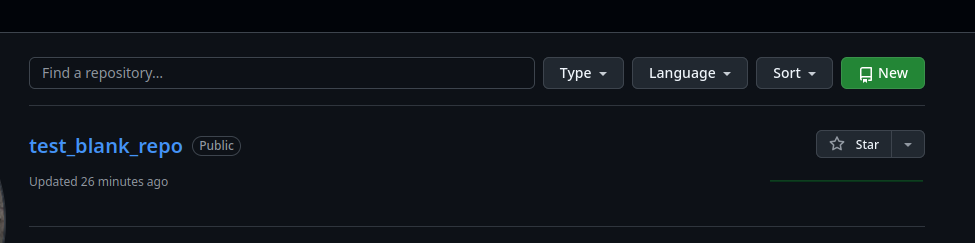
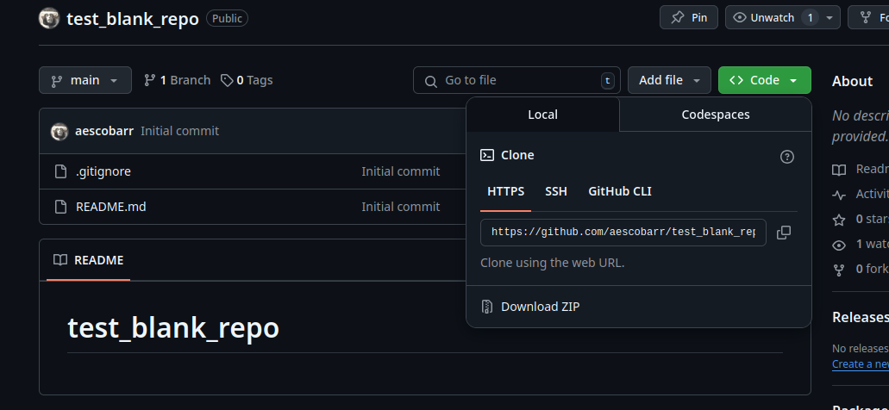

# Conceptes bàsics GitHub

## Instalació Git Windows

1. Descarregar Git Windows [Link descàrrega](https://git-scm.com/downloads/win)
2. Passos post instalació:

    Establir nom [d'usuari](https://docs.github.com/en/get-started/git-basics/setting-your-username-in-git)

    ```
    git config --global user.name "Sarah Smith"
    git config --global user.email "sarah.smith@email.com"
    ```

    En windows, la primera vegada que es clona un repositori https si es dóna autorització 3rd party al programari de github
    no cal tornar a entrar credencials per fer push.

## Què és Git?
TODO


## Creació de repositoris
### Creació d'un repositori des d'un directori ja existent

#### Creem un repositori des de github 

1. Anem al nostre perfil -> "Repositories"
2. Cliquem a "New"
3. Deixem totes les opcions per defecte (posem un nom al repositori)



#### Anem al directori que volem pujar i executem les comandes següents (o similars):        

```
echo "# test_create_repo" >> README.md
git init
git add README.md 
git commit -m "first commit"
git branch -M main
git remote add origin https://github.com/aescobarr/test_create_repo.git        
git push -u origin main
```
        
Crea un fitxer README.md (markdown) i li afegeix una línia.

En aquest nivell és molt recomanable crear un fitxer .gitignore. Aquest fitxer li indica a git quins fitxers o directoris
ha d'excloure del control de canvis.

Inicialitza el directori actual i li diu a git que aquest directori és un repositori. Aquest fitxer crea un directori que 
es diu ".git" que conté tota la informació de control de versions.

Aquesta comanda afegeix un fitxer al commit en curs. Afegim tants fitxers com calgui.

Quan ja tenim els fitxers afegits, establim el missatge del commit. Aquest missatge descriu breument els canvis que hem fet
i ens permet identificar el motiu del commit.

Aquesta comanda estableix el nom de la branca principal.

Aquesta comanda estableix l'adreça remota del repositori, on s'acabaran desant els canvis que fem en local.

Aquesta comanda puja els tots els canvis locals al repositori remot. A més, el paràmetre -u li diu que la branca local
es desa al remot "origin" (https://github.com/aescobarr/test_create_repo.git).


### Creació d'un repositori des de zero

Repetim els passos de "Creem un repositori des de github". En aquest cas, és recomanable no deixar les opcions
per defecte i demanar que github crei un fitxer .gitignore i un fitxer README.md.

A continuació anem a la pàgina del repositori (Repositories -> Nom del repositori) i despleguem la pestanya "code"



I copiem el link https. Amb aques link copiat, obrim una consola i anem al directori on volem recuperar el repositori acabat de crear.

```
C:\Users\agusti> cd Documents\codi
C:\Users\agusti\Documents\codi> git clone <link copiat>
```

Això ens crearà dins de "Documents" un directori amb el mateix nom que hem posat al repositori. 

## Treball amb repositoris

El cicle de treball amb un repositori es pot resumir com:

1. Canviem un o varis fitxers dins el directori
2. Quan ho decidim, afegim els fitxers canviats al commit actual (git add)
3. Posem un missatge de commit i fem el commit (git commit)
4. Pugem els canvis locals al repositori remot (git push)

### Vista del repositori en un commit concret
### Treball amb branques